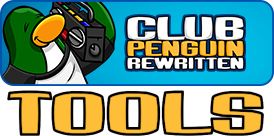

<div id="top"></div>

<div style="text-align: center;">

[![Contributors][contributors-shield]][contributors-url]
[![Forks][forks-shield]][forks-url]
[![Stargazers][stars-shield]][stars-url]
[![Issues][issues-shield]][issues-url]
[![MIT License][license-shield]][license-url]
[![LinkedIn][linkedin-shield]][linkedin-url]

</div>

<!-- PROJECT LOGO -->
<br />
<div align="center">
  <a href="https://github.com/BLovegrove/cpr-tools">
    
  </a>

<h3 align="center">CP:Rewritten Tools</h3>

  <p align="center">
    Some small scripts to make your time in Club Penguin: Rewritten a little easier.
    <!-- <br />
    <a href="https://github.com/BLovegrove/cpr-tools"><strong>Explore the docs »</strong></a> -->
    <br />
    <br />
    <!-- <a href="https://github.com/BLovegrove/cpr-tools">View Demo</a>
    · -->
    <a href="https://github.com/BLovegrove/cpr-tools/issues">Report Bug</a>
    ·
    <a href="https://github.com/BLovegrove/cpr-tools/issues">Request Feature</a>
  </p>
</div>


<!-- TABLE OF CONTENTS -->
<details>
  <summary>Table of Contents</summary>
  <ol>
    <li>
      <a href="#about-the-project">About The Project</a>
      <ul>
        <li><a href="#built-with">Built With</a></li>
      </ul>
    </li>
    <li>
      <a href="#getting-started">Getting Started</a>
      <ul>
        <li><a href="#prerequisites">Prerequisites</a></li>
        <li><a href="#installation">Installation</a></li>
      </ul>
    </li>
    <li><a href="#usage">Usage</a></li>
    <li><a href="#roadmap">Roadmap</a></li>
    <li><a href="#contributing">Contributing</a></li>
    <li><a href="#license">License</a></li>
    <li><a href="#contact">Contact</a></li>
    <li><a href="#acknowledgments">Acknowledgments</a></li>
  </ol>
</details>


<!-- ABOUT THE PROJECT -->
## About The Project

<br />

Recently got my little group of gaming buddies into club penguin for a nostalgia trip. Unfortunately, I love decorating my igloo and very much
<i>do not like</i> spending a year building up my gold reserves enough to do it properly.
<br/>when I finished the script that solved the gold issue (jackhammer-3001), I found it hard to keep up with certain minigames and the pizzatron-3001 
was born. 

<p align="right">(<a href="#top">back to top</a>)</p>


### Built With

* [AutoHotKey](https://www.autohotkey.com/)


<p align="right">(<a href="#top">back to top</a>)</p>


<!-- GETTING STARTED -->
## Getting Started

Setting this up for yourself is insanely easy.

### Prerequisites

This is an example of how to list things you need to use the software and how to install them.
* Latest AutoHotKey version
  ```sh
  sudo apt install autohotkey-gtk # for GNOME, autohotkey-qt for KDE
  ```
  (or head to [AHK's website](https://www.autohotkey.com/) and grab the latest copy for your OS there)

### Installation

1. Download / clone a copy of this repo
2. Install AutoHotKey
3. Run the script you need!

<p align="right">(<a href="#top">back to top</a>)</p>


<!-- USAGE EXAMPLES -->
## Usage

<h2>Jackhammer coin farm:</h2>
<div align="center">

<p align="right">
(Note: Before you do anything - make sure you click on your penguin, close your wardrobe if its open, and move it somewhere far out of the screen. 
I like to put mine so the tab you move it with is over the chat bar. This is because the bot might click a player sometimes and you dont want it covering 
its path)
<br/><br/>
Simply go over to the Mine Cave (found in the Mineshaft on the map) and pick up a mining helmet from the box.<br/>
Put on that helmet (and only that helmet) then move your penguin to a location in the dirt thats between 2 penguin-heights from the top of the dirt area, and  
about a penguins width from either side of it. Once you're standing in your new location, hit 'Shift' + 'd' and the sequence will begin.<br/>
Hit escape to end it.'
<br/><br/>
I like to leave mine on overnight wit my monitors turned off - I get about 200k coins every time! Just make sure you're tabbed in.
</p>
</div>

<br/><br/>

<h2>Pizzatron 3000 helper</h2>
<div align="center">

<p align="right">
Just start your script + pizzatron game, cover the pizza in sauce + cheese/sprinkles and then you can hit they keys 1/2/3/4 to 
instantly grab the 1st/2nd/3rd/4th ingredient from the cheese/sprinkles and move it to where your cursor is. This makes it as easy as 
following the pizza with your cursor and spamming the right key sequence. It doesnt work 100% of the time so just make sure it isnt dropping any.
</p>
</div>

<p align="right">(<a href="#top">back to top</a>)</p>


<!-- ROADMAP -->
## Roadmap

- [X] Simple afk coin gathering via jackhammer in the mine cave
- [X] Simplify the Pizzatron-3000 ingredient gameplay to selecting a single key per ingredient
- [ ] Use image recognition and OCR to completely automate the Pizzatron-3000
- [ ] Use image recognition to make the jackhammer coin farm faster and more reliable (detecting free spots etc.)
- [ ] Automate more minigames!

See the [open issues](https://github.com/BLovegrove/cpr-tools/issues) for a full list of proposed features (and known issues).

<p align="right">(<a href="#top">back to top</a>)</p>


<!-- CONTRIBUTING -->
## Contributing

Contributions are what make the open source community such an amazing place to learn, inspire, and create. Any contributions you make are **greatly appreciated**.

If you have a suggestion that would make this better, please fork the repo and create a pull request. You can also simply open an issue with the tag "enhancement".
Don't forget to give the project a star! Thanks again!

1. Fork the Project
2. Create your Feature Branch (`git checkout -b feature/AmazingFeature`)
3. Commit your Changes (`git commit -m 'Add some AmazingFeature'`)
4. Push to the Branch (`git push origin feature/AmazingFeature`)
5. Open a Pull Request

<p align="right">(<a href="#top">back to top</a>)</p>


<!-- LICENSE -->
## License

Distributed under the Apache 2.0 License. See `LICENSE.txt` for more information.

<p align="right">(<a href="#top">back to top</a>)</p>


<!-- CONTACT -->
## Contact
Brandon Lovegrove - [@B_A_Lovegrove](https://twitter.com/B_A_Lovegrove) - b.lovegrove.wsd@gmail.com

Project Link: [https://github.com/BLovegrove/cpr-tools](https://github.com/BLovegrove/cpr-tools)

<br />

Like my work?

<a href="https://www.buymeacoffee.com/blovegrove" target="_blank"></a>

<p align="right">(<a href="#top">back to top</a>)</p>


<!-- MARKDOWN LINKS & IMAGES -->
<!-- https://www.markdownguide.org/basic-syntax/#reference-style-links -->
[contributors-shield]: https://img.shields.io/github/contributors/BLovegrove/cpr-tools.svg?style=for-the-badge
[contributors-url]: https://github.com/BLovegrove/cpr-tools/graphs/contributors
[forks-shield]: https://img.shields.io/github/forks/BLovegrove/cpr-tools.svg?style=for-the-badge
[forks-url]: https://github.com/BLovegrove/cpr-tools/network/members
[stars-shield]: https://img.shields.io/github/stars/BLovegrove/cpr-tools.svg?style=for-the-badge
[stars-url]: https://github.com/BLovegrove/cpr-tools/stargazers
[issues-shield]: https://img.shields.io/github/issues/BLovegrove/cpr-tools.svg?style=for-the-badge
[issues-url]: https://github.com/BLovegrove/cpr-tools/issues
[license-shield]: https://img.shields.io/github/license/BLovegrove/cpr-tools.svg?style=for-the-badge
[license-url]: https://github.com/BLovegrove/cpr-tools/blob/master/LICENSE.txt
[linkedin-shield]: https://img.shields.io/badge/-LinkedIn-black.svg?style=for-the-badge&logo=linkedin&colorB=555
[linkedin-url]: https://linkedin.com/in/brandon-lovegrove-5ab4181a0
[product-screenshot]: images/ToyCar.png
[jackhammer-screenshot]: images/ToyCarDigging.png
[pizzatron-screenshot]: images/ToyCarPizza.png
