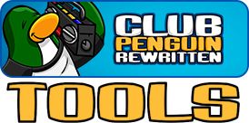
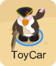
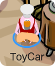

<div id="top"></div>

<div style="text-align: center;">

[![Contributors][contributors-shield]][contributors-url]
[![Forks][forks-shield]][forks-url]
[![Stargazers][stars-shield]][stars-url]
[![Issues][issues-shield]][issues-url]
[![MIT License][license-shield]][license-url]
[![LinkedIn][linkedin-shield]][linkedin-url]

</div>

<!-- PROJECT LOGO -->
<br />
<div align="center">
  <a href="https://github.com/BLovegrove/cpr-tools">
    
  </a>

<h3 align="center">CP:Rewritten Tools</h3>

  <p align="center">
    Some small scripts to make your time in Club Penguin: Rewritten a little easier.
    <!-- <br />
    <a href="https://github.com/BLovegrove/cpr-tools"><strong>Explore the docs »</strong></a> -->
    <br />
    <br />
    <!-- <a href="https://github.com/BLovegrove/cpr-tools">View Demo</a>
    · -->
    <a href="https://github.com/BLovegrove/cpr-tools/issues">Report Bug</a>
    ·
    <a href="https://github.com/BLovegrove/cpr-tools/issues">Request Feature</a>
  </p>
</div>


<!-- TABLE OF CONTENTS -->
<details>
  <summary>Table of Contents</summary>
  <ol>
    <li>
      <a href="#about-the-project">About The Project</a>
      <ul>
        <li><a href="#built-with">Built With</a></li>
      </ul>
    </li>
    <li>
      <a href="#getting-started">Getting Started</a>
      <ul>
        <li><a href="#prerequisites">Prerequisites</a></li>
        <li><a href="#installation">Installation</a></li>
      </ul>
    </li>
    <li><a href="#usage">Usage</a></li>
    <li><a href="#roadmap">Roadmap</a></li>
    <li><a href="#contributing">Contributing</a></li>
    <li><a href="#license">License</a></li>
    <li><a href="#contact">Contact</a></li>
  </ol>
</details>


<!-- ABOUT THE PROJECT -->
## About The Project


<p align="left">
Recently got my little group of gaming buddies into club penguin for a nostalgia trip. 
Unfortunately, I love decorating my igloo and very much <i>do not like</i> 
spending a year building up my gold reserves enough to do it properly.
<br/>when I finished the script that solved the gold issue (jackhammer-3001), 
I found it hard to keep up with certain minigames and the pizzatron-3001 was born.
</p>
<br/>


<p align="right">(<a href="#top">back to top</a>)</p>


### Built With

* [Python 3.10](https://www.python.org/downloads/release/python-3100/)
* [OpenCV](https://opencv.org/)
* [Tesseract OCR](https://github.com/tesseract-ocr/tesseract)
* [opencv-python](https://pypi.org/project/opencv-python/)
* [pytesseract](https://pypi.org/project/pytesseract/)


<p align="right">(<a href="#top">back to top</a>)</p>


<!-- GETTING STARTED -->
## Getting Started

Setting this up for yourself is fairly easy if you're on Linux.
If you're on Windows, you'll need to find out how to get Tesseract running and I can't offer any guarantees as to performance or even basic functionality as tesseract has no official Windows binaries for its latest version(s) as of writing this.<br/>
Though if you've neevr tried linux, I'd highly recommend rying [Pop!_os](https://pop.system76.com/) by System76 - It's a fantastic operating syustem and one that I use exclusively

### Prerequisites

This is an example of how to list things you need to use the software and how to install them.
* [Python 3.10](https://www.python.org/downloads/)
  ```sh
  sudo apt install python3.10 # Debian Linux
  ```
* [pipenv](https://pypi.org/project/pipenv/) for python 3.10
  ```sh
  python3.10 pip install pipenv
  ```
* Latest [OpenCV](https://opencv.org/) version
  ```sh
  sudo apt install python3-opencv # Debian Linux
  ```
* latest [Tesseract](https://tesseract-ocr.github.io/tessdoc/Downloads.html) version
  ```sh
  sudo apt install tesseract-ocr # Debian Linux
  ```

### Installation

1. Download / clone a copy of this repo
2. Install prerequisits
3. Run ```pipenv install``` inside cloned directory for dependencies
4. Edit [display] category in the config.toml file to match your monitor

<p align="right">(<a href="#top">back to top</a>)</p>


<!-- USAGE EXAMPLES -->
## Usage

<h3>Pizzatron 3000 helper (AHK script)</h3>
<p align="left">
Just start your script + pizzatron game, cover the pizza in sauce + cheese/sprinkles and then you can hit they keys 1/2/3/4 to 
instantly grab the 1st/2nd/3rd/4th ingredient from the cheese/sprinkles and move it to where your cursor is. This makes it as easy as 
following the pizza with your cursor and spamming the right key sequence. It doesnt work 100% of the time so just make sure it isnt dropping any toppings.<br/><br/>
(Please note: This is old code so I won't be providing install or setup instructions. It's fairly straight forward though - just head to Auto Hotkey's website and ahve a look.)
</p>
<br/>
<h3>Pizzatron 3001 Automaton (W.I.P)</h3>

<p align="left">
Once you've run through your install process, jump into a terminal window inside the cloned git location (I'd recommend running VSCode as an editor which does this for you) and run the command 'pipenv run python -m toolbox' to start the bot.<br/><br/>
The bot will wait until it finds the pizza ingredients / stats billboard before it starts running anything heavy. When it starts you'll get a p[op-up window that will update when the minigame starts. You can resize it and move it wherever is most convenient for you before the game starts. 
<br/><br/>
Currently the bot is only capable of tracking objects and displaying a preview of what its tracking with labels / bounding boxes / tracking points. The next step I'm working on will allow the bot to add sauce + cheese/sprinkles to the pizza and any toppings required based on the name of the pizza you're being asked to make.
</p>


<p align="right">(<a href="#top">back to top</a>)</p>


<!-- ROADMAP -->
## Roadmap

- [X] ~~Simplify the Pizzatron-3000 ingredient gameplay to selecting a single key per ingredient~~
- [ ] Use computer vision and OCR to completely automate the Pizzatron-3000
- [ ] Automate more minigames!

See the [open issues](https://github.com/BLovegrove/cpr-tools/issues) for a full list of proposed features (and known issues).

<p align="right">(<a href="#top">back to top</a>)</p>


<!-- CONTRIBUTING -->
## Contributing

Contributions are what make the open source community such an amazing place to learn, inspire, and create. Any contributions you make are **greatly appreciated**.

If you have a suggestion that would make this better, please fork the repo and create a pull request. You can also simply open an issue with the tag "enhancement".
Don't forget to give the project a star! Thanks again!

1. Fork the Project
2. Create your Feature Branch (`git checkout -b feature/AmazingFeature`)
3. Commit your Changes (`git commit -m 'Add some AmazingFeature'`)
4. Push to the Branch (`git push origin feature/AmazingFeature`)
5. Open a Pull Request

<p align="right">(<a href="#top">back to top</a>)</p>


<!-- LICENSE -->
## License

Distributed under the Apache 2.0 License. See `LICENSE.txt` for more information.

<p align="right">(<a href="#top">back to top</a>)</p>


<!-- CONTACT -->
## Contact
Brandon Lovegrove - [@B_A_Lovegrove](https://twitter.com/B_A_Lovegrove) - b.lovegrove.wsd@gmail.com

Project Link: [https://github.com/BLovegrove/cpr-tools](https://github.com/BLovegrove/cpr-tools)

<br />

Like my work?

<a href="https://www.buymeacoffee.com/blovegrove" target="_blank"></a>

<p align="right">(<a href="#top">back to top</a>)</p>


<!-- MARKDOWN LINKS & IMAGES -->
<!-- https://www.markdownguide.org/basic-syntax/#reference-style-links -->
[contributors-shield]: https://img.shields.io/github/contributors/BLovegrove/cpr-tools.svg?style=for-the-badge
[contributors-url]: https://github.com/BLovegrove/cpr-tools/graphs/contributors
[forks-shield]: https://img.shields.io/github/forks/BLovegrove/cpr-tools.svg?style=for-the-badge
[forks-url]: https://github.com/BLovegrove/cpr-tools/network/members
[stars-shield]: https://img.shields.io/github/stars/BLovegrove/cpr-tools.svg?style=for-the-badge
[stars-url]: https://github.com/BLovegrove/cpr-tools/stargazers
[issues-shield]: https://img.shields.io/github/issues/BLovegrove/cpr-tools.svg?style=for-the-badge
[issues-url]: https://github.com/BLovegrove/cpr-tools/issues
[license-shield]: https://img.shields.io/github/license/BLovegrove/cpr-tools.svg?style=for-the-badge
[license-url]: https://github.com/BLovegrove/cpr-tools/blob/main/LICENSE.txt
[linkedin-shield]: https://img.shields.io/badge/-LinkedIn-black.svg?style=for-the-badge&logo=linkedin&colorB=555
[linkedin-url]: https://linkedin.com/in/brandon-lovegrove-5ab4181a0
